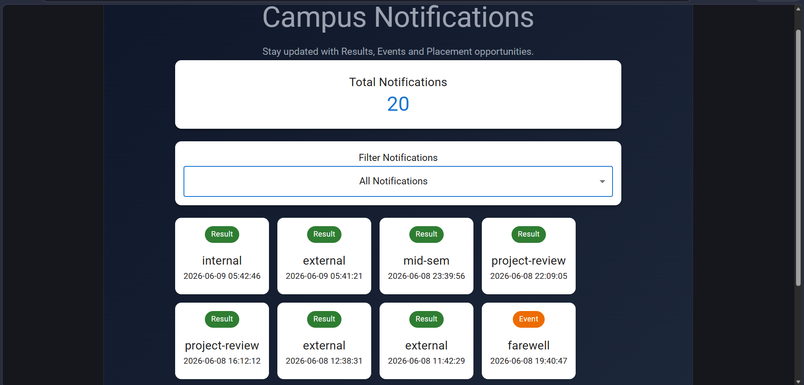
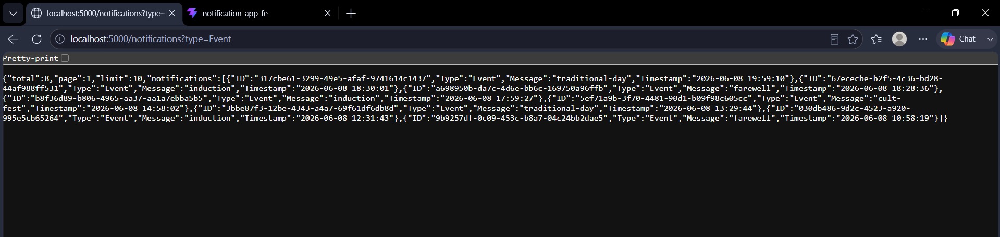
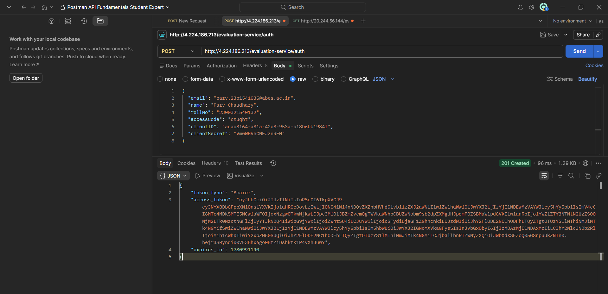

# Campus Notifications System Design

## Architecture

Frontend (React + Vite)
↓
Backend (Node.js + Express)
↓
Affordmed Notifications API

## Components

- Notification Service
- Notification Card
- Filter Bar
- Logging Middleware

## Features

- Notification Fetching
- Priority Sorting
- Pagination
- Filtering
- Error Handling
- Logging

## Notification Priority

1. Result
2. Event
3. Placement

## Logging Middleware

Centralized logging module used across frontend and backend for:
- Info Logs
- Warning Logs
- Error Logs

## API Flow

Frontend → Backend → Affordmed API → Backend → Frontend

# Campus Notifications System

## Home Page

## backend

## postman

